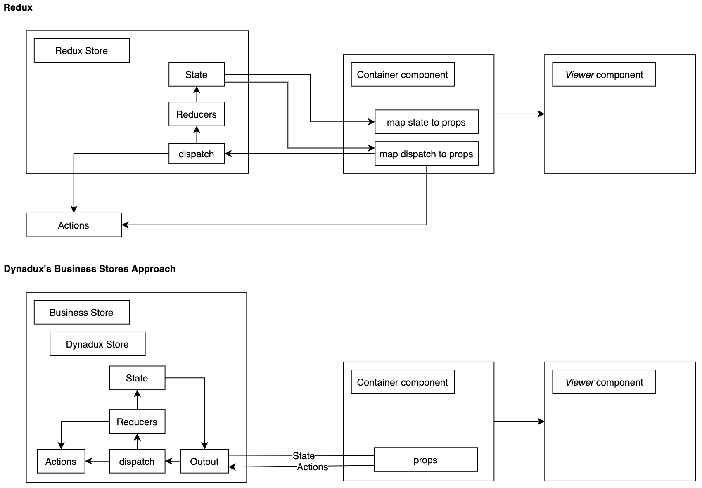

##### Table of Contents  
* [What is Dynadux](#whatIs)  
* [How does it work?](#howItWorks)  
* [Motivation](#motivation)  
* [Create a Store](#createAStore)  
* [Create a Business Store](#createABusinessStore)  
* [Architecture](#architecture)  
* [API](doc/API.md)
    * [Create store](doc/API-CreateStore.md)
    * [Reducers](doc/API-Reducers.md)
    * [Dispatch](doc/API-Dispatch.md)
    * [Middlewares](doc/API-Middlewares.md)
    * [Sections](doc/API-Sections.md)
    * [Debugging](doc/API-Debugging.md)
* [Use it in React](./doc/React.md)
* [Examples](./doc/Examples.md)
* [Advanced](./doc/Advanced.md)
    * [Dispatch Promises](doc/Advanced-DispatchPromises.md)
    * [Block Changes (and renders)](doc/Advanced-BlockChanges.md)
    * [Debounce Changes](doc/Advanced-DebounceChanges.md) _and React renders_
    * [Create 3rd party Library](doc/Advanced-Create3rdPartyLibrary.md)
    * [Understanding Dispatches in Reducer](doc/Advanced-UnderstandingDispatchesInReducer.md)
* [Typescript](./doc/Typescript.md)
* [Terminology](./doc/Terminology.md)
* [Change Log](doc/Change-Log.md)
* [FAQ](./doc/FAQ.md)

<a name="whatIs"/>

# What is Dynadux

Advanced and straightforward Stores based on dispatched Actions and Reducers.

Dynadux is an alternative to Redux, and it reduces Redux's boilerplate.

It can work for NodeJs libraries, React/Vue Apps, or React Components without complementary libraries.

Dynadux works with any UI layer.

Super light, zero dependencies, 2.2kb zipped bundle effort.

[See the live examples](./doc/Examples.md).

<a name="howItWorks"/>

# How does it work?

In general 
- You dispatch actions
- Dynadux is calling the reducers and middlewares
- Dynadux is calling the `onChange` callback with the new state

<a name="motivation"/>

# Motivation

## Benefits to working with Dynadux instead of classic setState

- Reusable State Management.
- The use of pure reducer functions.
- Centralizing the state makes.
- Debuggable.
- History of the changes.

[Benefits instead of Redux](doc/InsteadOfRedux.md).

# Install
```
npm install dynadux
```
or
```
yarn add dynadux
```
Types are already there. _Dynadux is written in TypeScript._

# Import
```
import {createStore} from "dynadux";
```
Everything of Dynadux is imported with `{} from "dynadux`, _no default exports_.

<a name="createAStore"/>

# Create a Store
This is the store to add and remove todo items.

```
const actions = {
  ADD_TODO: 'ADD_TODO',
  REMOVE_TODO: 'REMOVE_TODO',
};

const store = createStore({
    initialState: {
        todos: [],
    },
    reducers: {
          [actions.ADD_TODO]: ({state: {todos}, payload}) => {
            return {
              todos: todos.concat(payload),
            };
          },
          [actions.REMOVE_TODO]: ({state: {todos}, payload: todoId}) => {
            return {
              todos: todos.filter(todo => todo.id !== todoId),
            };
          },
    },
    onChange: (state) => console.log('State changed:', state),
});
```
Now lets add a todo
```
store.dispatch(actions.ADD_TODO, {id: '234', label: 'Drink beers'}});
```
Let's remove this todo
```
store.dispatch(actions.REMOVE_TODO, '234');
```
On every change the `onChange` will be called with the above code will be consoled.

<a name="createABusinessStore"/>

# Create a Business Store (Dynadux's approach)

Create business logic stores and methods.

> Note: this is a suggestion, not mandatory.

It is nice to have a store and dispatch actions, but we can do something more.

## What is Business Store

The Business Store is a function that
- creates a Dynadux store that is used internally in this function only
- we pass to the Dynadux the initial state and the actions/reducers dictionary object 
- the function returns an object with methods and getters, and this is the API of our Business store

The containers and any other components will use these getters and functions. 

## The principals

- wrap the create Dynadux store
- return a getter for the state
- return business logic methods that dispatch actions
- do not expose the dispatch _but expose methods that dispatch actions_
- do not expose the store _to ensure that the store handled properly_

```
const createTodoAppStore = (onChange) => {
    const store = createStore({
        initialState: {
            todos: [],
        },
        reducers: {
              [actions.ADD_TODO]: ({state: {todos}, payload}) => {
                return {
                  todos: todos.concat(payload),
                };
              },
              [actions.REMOVE_TODO]: ({state: {todos}, payload: todoId}) => {
                return {
                  todos: todos.filter(todo => todo.id !== todoId),
                };
              },
        },
        onChange,
    });

    return {
        get state() { return store.state; },
        addTodo: (todo) => store.dispatch(actions.ADD_TODO, todo),
        removeTodo: (todoId) => store.dispatch(actions.REMOVE_TODO, todoId),
    };
};

```
This is a function that creates the store and provides business logic methods. The `addTodo` & the `removeTodo`.

## Usage of the Bussiness Store

Now our `store` it won't be directly a `dynadux` store but a more sophisticated business one.

```
const store = createTodoAppStore(state => console.log('State change:', state));

```

And we can add a todo in a more business logic way.

```
store.addTodo({id: '121', label: 'Drink beers'});
```

And remove it in a more straightforward way.

```
store.removeTodo('121');
```

For React components the store should be instantiated in constructor.
```
const store = createTodoAppStore(() => this.setState({}));

```

Then pass the `store` to children and use the `store.state` for the state.

It is not needed to pass the entire store to the children, only pass what is needed.

## Benefits of Business stores

In the Business store approach, the Containers are not dispatching actions, but they use the methods of the store.

The action would be dispatched from any container. But some actions are for the internal use of the reducers. 
Also, each action requires a specific type of payload. But from the action's user perspective it is unclear which payload type should be used.

All these problems are solved providing to the containers javascript methods that do all this job. These are the Business methods provided by the app store that is wrapping the Dynadux store.

In the end, only business methods, reducers, and middlewares are dispatching actions. That makes the code much cleaner, and the actions can be used safely. 

## Redux/Dynadux Containers Connection Comparison



[Diagram](https://drive.google.com/file/d/1SWPbCHS5I8YCdTeCbNMUm8Nfy3eEgu59/view?usp=sharing)

# That's all

The logic of Dynadux depicted in the text above. 

There is nothing more. Portable and straightforward, use your imagination and create Business Stores.

<a name="architecture"/>

# Dynadux's Architecture

**Dynadux is an elementary library.** Technically the Dynadux is only an 

`Object.assign({}, state, middleware.before(), reducer(), middleware.after())`

And nothing else! Since it is small and straightforward, we can use it in the architecture of Business Stores. 

<a name="api"/>

# API

Learn the API to master the Dynadux.

- [Create store](doc/API-CreateStore.md)
- [Reducers](doc/API-Reducers.md)
- [Middlewares](doc/API-Middlewares.md)
- [Sections](doc/API-Sections.md)
- [Debugging](doc/API-Debugging.md)
- 🎉 and that's it, you are mastering the Dynadux!

<a name="readMore"/>

# Read more 

- [FAQ](./doc/FAQ.md) Frequently asked questions
- [Use it in React](./doc/React.md) How to use it in react
- [Examples](./doc/Examples.md) Live examples. Examples compared to redux's implementations
- [Advanced](./doc/Advanced.md) Dispached promises, boost up your app and more
- [Typescript](./doc/Typescript.md) Tips for Typescript implementations
- [Terminology](./doc/Terminology.md) Terminology of dynadux, (is small!)
- [History, Undo/Redo](https://github.com/aneldev/dynadux-history-middleware) Middleware for History, Undo/Redo and Restore Points
- [React Dynadux](https://github.com/aneldev/react-dynadux) Provider for Dynadux App Stores
- [Change Log](./Change-Log.md) Changes of Dynadux per semver version
