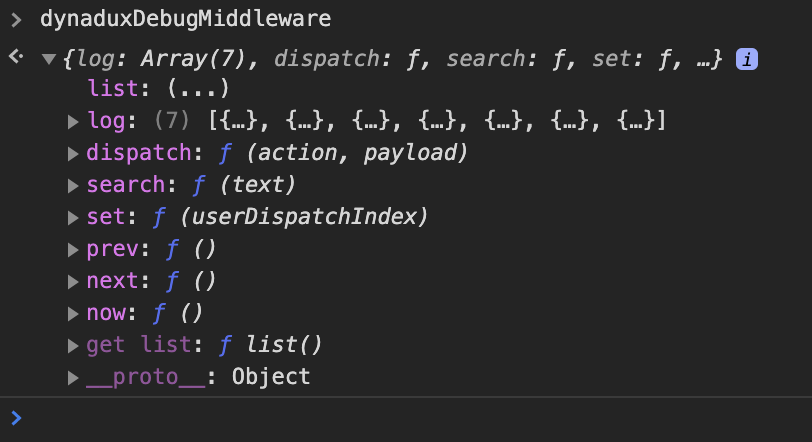
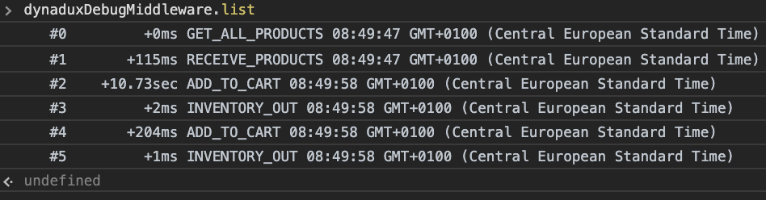
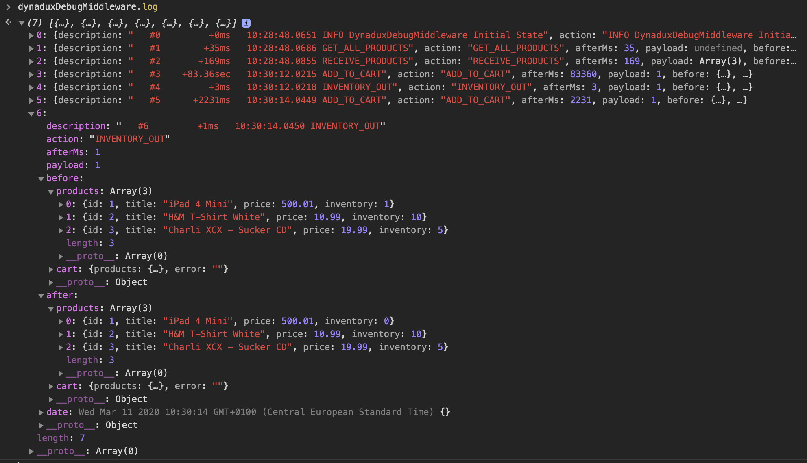

[🏠 Home](../README.md)

# Dynadux - Debugging

# dynaduxDebugMiddleware

Dynandux comes with middleware for debugging that collects the dispatched actions in a global array.

Then from the debugger, you can access the dispatched actions with stats and the current state. 

_Still we don't have a UI debugger like Redux, but we are working to make it happen. Feel free to contribute. But still, you can do a lot of things with dynaduxDebugMiddleware!_

A significant benefit of not using a plugin debugger, but only this middleware is the performance.
Plugging debuggers are crashing on a significant amount of data since they scan your state.

With this middleware, the only CPU effort is what you expand from the global array. 

`dynaduxDebugMiddleware` collects the dispatches in an array that you can manipulate it, providing few methods.

## Features

- The State Before and After dispatched
- An array of the dispatched actions, you can filter, etc
- Access, iterate and investigate previous states programmatically or manually
- Elapsed time of the prior dispatch
- A timestamp for each dispatch
- Set a previous state
- Travel in the time applying states

## Usage

#### Minimum configuration

```
import {createStore, dynaduxDebugMiddleware} from "dynadux";

const store = createStore({
    initialState: {...},
    middlewares: [
        dynaduxDebugMiddleware({
          debuggerStoreName: 'debug_myStore',   // Required, empty string means disabled debugger.
        }),
    ],
    reducers: {...},
});

```

#### Full configuration

```
import {createStore, dynaduxDebugMiddleware} from "dynadux";

const store = createStore({
    initialState: {...},
    middlewares: [
        dynaduxDebugMiddleware({
          debuggerStoreName: 'debug_myStore',   // Required
          consoleDispatch: true,                // Optional, this is the default value
          consolePayload: false,                // Optional, this is the default value
          consolePayload: 'debug',              // Optional, this is the default value
        }),
    ],
    reducers: {...},
});

```

With the above config, the `dynaduxDebugMiddleware` creates the debugger on the global variable name `debug_myStore`. 

This middleware, like many other debugging tools, should not be on production since it would lead to a memory leak.

## dynaduxDebugMiddleware configuration API

```
interface IDynaduxDebugMiddlewareConfig {
  debuggerStoreName: string;        // Required, otherwise the middleware will be not loaded.
  consoleDispatch?: boolean;        // On After dispatch, default: true
  consolePayload?: boolean;         // Console the payload, default: false
  consoleMethod?: 'log' | 'debug';  // Default: debug
}
```

The `debuggerStoreName` is required. However, if you assign an empty string, this is an indication to do not load the debugger, and the performance will not be affected.

So the flag if the debugger will be loaded is if the `debuggerStoreName` is an empty string or not.

In this way, you can always include the debugger on production and switch activation, providing a `debuggerStoreName` or not.

## dynaduxDebugMiddleware exported API

Open the console and type the value of the `debuggerStoreName`,for instance `debug_myStore`.

You will get something like this:



### dynaduxDebugMiddleware.list

Open the console and type `debug_myStore.list`

You will get something like this:



`list` returns a preview of the collected log items.

### dynaduxDebugMiddleware.listPayloads

Same as `list`, including the payloads.

### dynaduxDebugMiddleware.log

Open the console and type `debug_myStore.log`

You will get something like this:



In `log` are the collected dispatched items by the debugger middleware.

### dynaduxDebugMiddleware.log[index]

You can access the history item by the index shown in the description.

For instance, type to access the log:

`debug_myStore.log[3]` 

or 

`debug_myStore.log[3].after.cart`

### dynaduxDebugMiddleware.state

Get the currently active state.

### dynaduxDebugMiddleware.search(text: string)

`dynaduxDebugMiddleware` provides the `search` method where you can search for a text in the description of the log item non-case sensitive.

For instance:

`debug_myStore.search('add_todo')`

### dynaduxDebugMiddleware.log.filter/map/find/etc

Since the `log` is the array, you can use all javascript Array's methods.

For instance: 

`debug_myStore.log.filter(log => log.action === 'ADD_TODO')`

or filter even more

`debug_myStore.log.filter(log => log.action === 'ADD_TODO').filter(log => log.payload > 1)`

### dynaduxDebugMiddleware.dispatch(action: string, payload?: any)

Manually dispatch an action from debugger's console.

`debug_myStore.dispatch('ADD_TODO', {id: '445', label: 'Drink a Debug beer'})`

### dynaduxDebugMiddleware.set(index) Set a previous state

It is useful for debugging to get back in time, at a specific point, to see how the app was then. Traveling in time is helpful for animation implementations also!

`debug_myStore.set(1)`

### dynaduxDebugMiddleware.prev/next/now() Travel in time

You can travel in time with the methods `debug_myStore.prev()` and `debug_myStore.next()`.

To run back to now `debug_myStore.now()`.

Every time the app is dispatching something, time is reset to now.

# 🎉 Your training is done

Ones you reached this point, you are mastering the Dynadux! It is so simple!

You can go further reading the Advanced but is not mandatory.

[⬅️ Middlewares](./Middlewares.md) 🔶 [Advanced ➡️](./Advanced.md) 

# Read more 

- [FAQ](./FAQ.md) Frequently asked questions
- [React](./React.md) How to use it in react
- [Sections](./Sections.md) Create sections for applications or big components
- [Examples](./Examples.md) Live examples. Examples compared to redux's implementations
- [Advanced](./Advanced.md) Dispached promises, boost up your app and more.
- [Terminology](./Terminology.md) Terminology of dynadux, (is small!).
- [History, Undo/Redo](https://github.com/aneldev/dynadux-history-middleware) Middleware for History, Undo/Redo and Restore Points.
- [React Provider](https://github.com/aneldev/dynadux-provider) React Provider for Dynadux App Stores
- [Changelog](./Changelog.md) Changes of Dynadux per semver version
- [🏠 Home, Contents](../README.md#table-of-contents)
