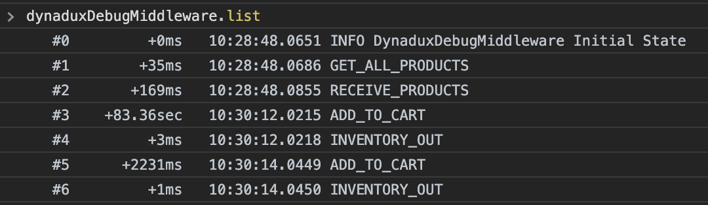

[🏠 Home](../README.md)

# Dynadux - Debugging

# dynaduxDebugMiddleware

Dynandux comes with middleware for debugging that collects the dispatched actions in a global array.

Then from the debugger, you can access the dispatched actions with stats. 

_Still we don't have a nice debugger like Redux but we are working to make it happen. Feel free to contribute. But still, you can do a lot of things with dynaduxDebugMiddleware!_

A big benefit not using a plugin debugger but only this middleware is the performance.
Plugging debuggers are crashing on a big amount of data since they scan your state.

Using this middleware, the CPU effort is only what you expand from the global array. 

`dynaduxDebugMiddleware` collects the dispatches in an array that you can manipulate it providing few methods.

## Features

- The State Before and After dispatched
- An array of the dispatched, you can filter, etc
- Access, iterate and investigate previous states programmatically or manually
- Elapsed time from the previous dispatch
- A timestamp for each dispatch
- Set a previous state
- Travel in the time applying states

## Usage

```
import {createStore, dynaduxDebugMiddleware} from "dynadux";

const store = createStore({
    initialState: {
        todos: [],
    },
    middlewares: [
        dynaduxDebugMiddleware(),
    ],
    reducers: {
        // ...
    },
});

```

`dynaduxDebugMiddleware` adds to the global array variable `dynaduxDebugMiddleware` all the dispatched items.

This middleware, like many other debugging tools, should not be on production since it would lead to a memory leak.

## API of dynaduxDebugMiddleware

## Start the middleware

```
const store = createStore({
    initialState: {
        todos: [],
    },
    middlewares: [
        dynaduxDebugMiddleware(),
    ],
    reducers: {
        // ...
    },
});
```
As a parameter, it accepts a configuration object with this interface.

```
interface IDynaduxDebugMiddlewareConfig {
  globalVariableName?: string;
}
```
When you work with multiple stores it makes sense to save debugging info of the `dynaduxDebugMiddleware` in different global variables.

To load the middleware and save the array in different global name, for instance `debugState`, we can create the middleware like this:

```
const store = createStore({
    initialState: {
        todos: [],
    },
    middlewares: [
        dynaduxDebugMiddleware({ globalVariableName: 'dynaduxDebugMiddleware_StoreTodo' }),
    ],
    reducers: {
        // ...
    },
});
```

## dynaduxDebugMiddleware API

Open the console and type `dynaduxDebugMiddleware`

You will get something like this:


### dynaduxDebugMiddleware.list

Open the console and type `dynaduxDebugMiddleware.list`

You will get something like this:



`list` returns a preview of the collected log items.

### dynaduxDebugMiddleware.listPayloads

Same as `list` including the payloads.

### dynaduxDebugMiddleware.log

Open the console and type `dynaduxDebugMiddleware.log`

You will get something like this:


In `log` are the collected dispatched items by the debugger middleware.

### dynaduxDebugMiddleware.log[index]

You can access the history item by the index shown in the description.

For instance, type to access the log:

`dynaduxDebugMiddleware.log[3]` 

or 

`dynaduxDebugMiddleware.log[3].after.cart`

### dynaduxDebugMiddleware.state

Get the current active state.

### dynaduxDebugMiddleware.search(text: string)

`dynaduxDebugMiddleware` provides the `search` method where you can search for a text in the description of the log item non-case sensitive.

For instance:

`dynaduxDebugMiddleware.search('add_todo')`

### dynaduxDebugMiddleware.log.filter/map/find/etc

Since the `log` is the array you can use all javascript Array's methods.

For instance: 

`dynaduxDebugMiddleware.log.filter(log => log.action === 'ADD_TODO')`

or filter even more

`dynaduxDebugMiddleware.log.filter(log => log.action === 'ADD_TODO').filter(log => log.payload > 1)`

### dynaduxDebugMiddleware.dispatch(action: string, payload?: any)

Manually dispatch an action from debugger's console.

`dynaduxDebugMiddleware.dispatch('ADD_TODO', {id: '445', label: 'Drink a Debug beer'})`

### dynaduxDebugMiddleware.set(index) Set a previous state

It is useful for debugging to get back in time, at a specific point to see how was the app then. This is useful for animations also!

`dynaduxDebugMiddleware.set(1)`

### dynaduxDebugMiddleware.prev/next/now() Travel in time

You can travel in time with the methods `dynaduxDebugMiddleware.prev()` and `dynaduxDebugMiddleware.next()`.

To run back to now `dynaduxDebugMiddleware.now()`.

Every time the app is dispatching something, time is reset to now.

# 🎉 Your training is done

Ones you reached this point you are mastering the Dynadux! It is so simple!

You can go further reading the Advanced but is not mandatory.

[⬅️ Middlewares](./Middlewares.md) 🔶 [Sections ➡️](./Sections.md) 

# Read more 

- [FAQ](./FAQ.md) Frequently asked questions
- [React](./React.md) How to use it in react
- [Examples](./Examples.md) Live examples. Examples compared to redux's implementations
- [Advanced](./Advanced.md) Dispached promises, boost up your app and more.
- [Terminology](./Terminology.md) Terminology of dynadux, (is small!).
- [History, Undo/Redo middleware](https://github.com/aneldev/dynadux-history-middleware) Middleware for History, Undo/Redo and Restore Points.
- [🏠 Home, Contents](../README.md#table-of-contents)
